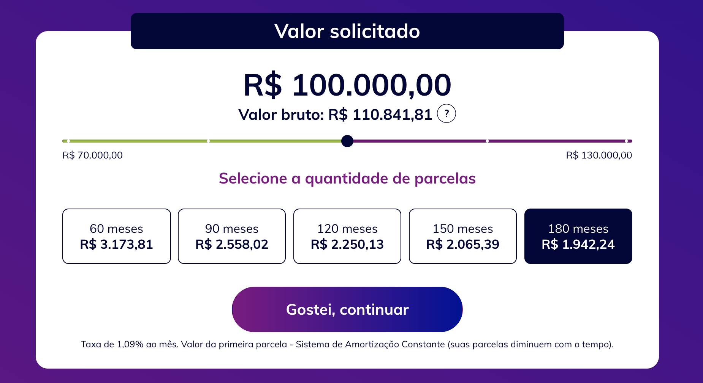

# Pontte Coding Challenge

## 1. Descrição

Seu desafio é desenvolver um componente que mostra um range de valores para um empréstimo e os valores e números de parcelas de acordo com o valor selecionado.
O layout que deve ser seguido está demonstrado de uma forma visual no item 3 e descrito cada ponto do layout no item 4.

Os dados tem que ser coletados do endpoint http://testfrontend.pontte.com.br/.


## 2. Requisitos
- Utilizar o React para o desenvolvimento do componente.
- Usar qualquer pré-processado de CSS (SASS, Stylus).


## 3. Layout


## 4. Descrição do Layout
- O valor com a fonte maior, corresponde ao valor do empréstimo e o valor a baixo representa o valor bruto do empréstimo.
- A barra corresponde ao valor do empréstimo pode conter X steps de acordo com a quantidade de valores possível. Seu comportamento é parecido com o input com o type range.
- Os números nas laterais abaixo da barra são referentes ao menor e o maior valor possível de empréstimo.
- Existe a possibilidade de ter ate 5 box correspondentes as possibilidade te tempo do empréstimo, e podendo ter no mínimo 1 de acordo com os dados.
- Os valores das parcelas de cada mês têm que ser formatado em real.
- Ao selecionar um valor de empréstimo, tem que ser atualizados os valores acima da barra e os valores das parcelas.
- O botão "Gostei, continuar" deve ser somente habilitado quando o usuário selecionar um valor e uma parcela.

## 5. Descrição do endpoint
Endpoint: `http://testfrontend.pontte.com.br/`
```
{
      "type": "object",
      "description": "Dados de uma simulação de empréstimo",
      "properties": {
          "prazos": {
              "type": "array",
              "description": "Todos os prazos"
          },
          "valoresEmprestimo": {
              "type": "array",
              "description": "Todos os valores liquido"
          },
          "valoresEmprestimeBruto": {
              "type": "array",
              "description": "Todos os valores bruto"
          },
          "parcelas": {
              "type": "array",
              "description": "Valor da primeira parcela correspondente a cada prazo"
              "items": {
                  "type": "array",
                  "description": "Valor da primeira parcela correspondente ao valor selecionado"
              }
          }
      }
}
```

- O número de box e os valores de meses devem ser montados de acordo com a propriedade `prazos`
- O valor do empréstimo bruto corresponde a mesma posição do valor do empréstimo selecionado. Ex.: Se o valor do empréstimo selecionado for o segundo (`valoresEmprestimo[1]`), o valor bruto sera a segunda posição (`valoresEmprestimeBruto[1]`)
- As parcelas estão separadas primeiramente de acordo com o prazo, então se foi selecionado o primeiro prazo, o valor da parcela estará na primeira posição e os valores das parcelas de cada prazo estão separados de acordo com o valor do empréstimo selecionado. Ex.: Se o usuário selecionou o 2 valor e o primeiro prazo, o valor correto da parcela estaria em `parcelas[1][0]`.

## 4. Diferencial
- Aplicação de um layout reponsivel
- Uso de Redux.
- Documentação do código e componentes.
- Testes unitários e ou de integração.
